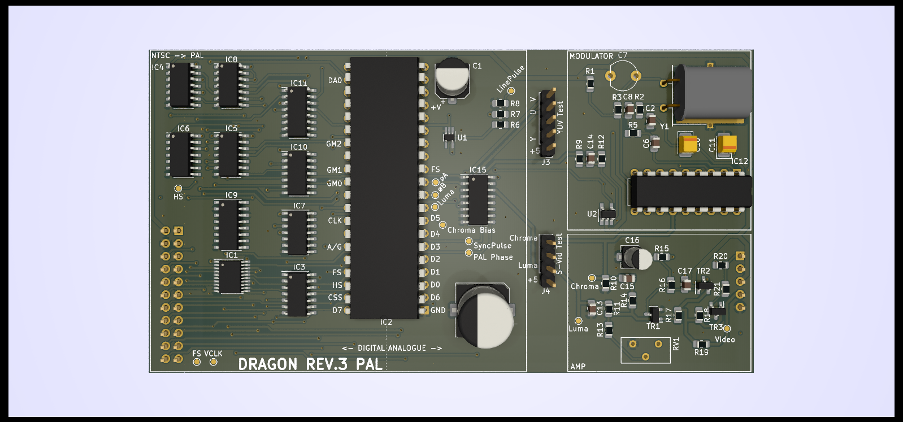

# PAL VIDEO BOARD FOR DRAGON 32 RECREATION Rev 3 #

To further improve video quality on the Dragon 32 this
board completely isolates the video circuits from the rest
of the Dragon by making it a plugin. This also means that
only a single version of the Dragon 32 board is needed to
provide a PAL or NTSC solution.

## Progress ##

This is a complete first hack at the design, while the
schematics are trusted the layout and organisation of the
line pulse logic is very much experimental.

The clock generator and analogue circuits are completely
isolated. The ground plane on the analogue side of the board 
is as complete and uniform as possible.

## To Do ##

Adopt the Dragon 64 voltage bias circuit for the output
signal
